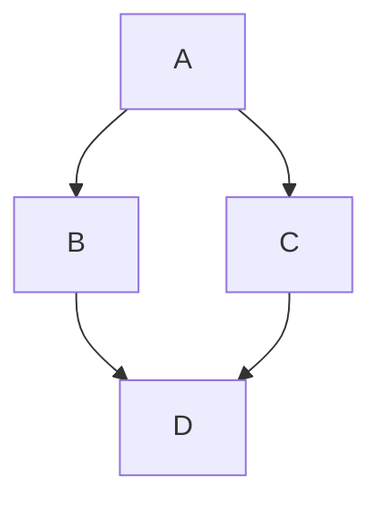
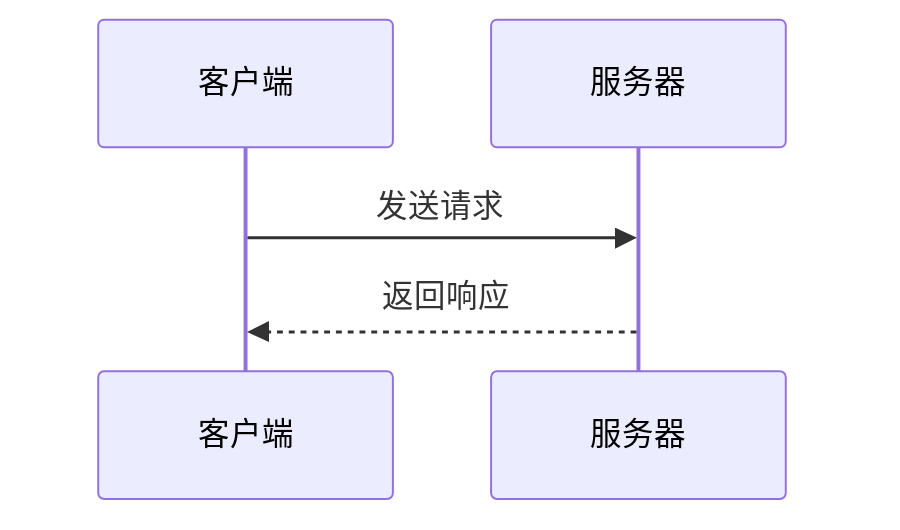
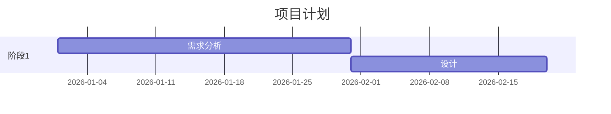

Welcome to [Hexo](https://hexo.io/)! This is your very first post.

## 脚注测试

这是一段带有脚注的文字[^1]。

[^1]: 这是一个脚注示例，展示了 footnote 插件的效果。

## 高亮测试

这段文字包含 ==高亮内容==，这是 ==另一个高亮==。

## Emoji 测试

:smile: :heart: :rocket: :fire:

## 数学公式测试

行内公式：$E = mc^2$

块级公式：

$$
\sum_{i=1}^{n} i = \frac{n(n+1)}{2}
$$

## Callout 测试

> [!note] 笔记
> 这是一条笔记类型的 Callout，用于记录重要信息。

> [!tip] 提示
> 这是一条提示，给你一些有用的建议。

> [!warning] 警告
> 这是一条警告，需要注意潜在问题。

> [!danger] 危险
> 这是危险提示，请务必小心！

> [!info]
> 不带自定义标题的 info 类型。

> [!question] 问题
> 这是一个问题类型的 Callout。

> [!example] 示例
> 这是一个示例展示。

> [!quote] 引用
> 这是一条引用风格的 Callout。

## Mermaid 测试

## Embed 测试

![[About]]

查看 [[test]] 页面获取更多信息。
也可以参考关于页面 [[About]]。
