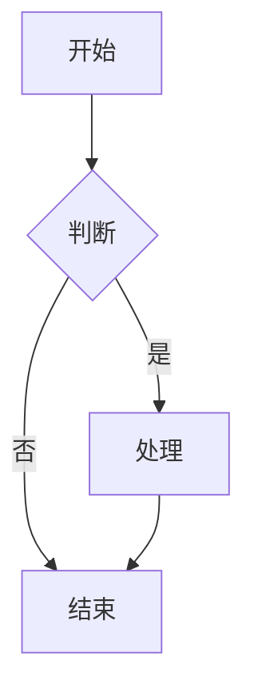
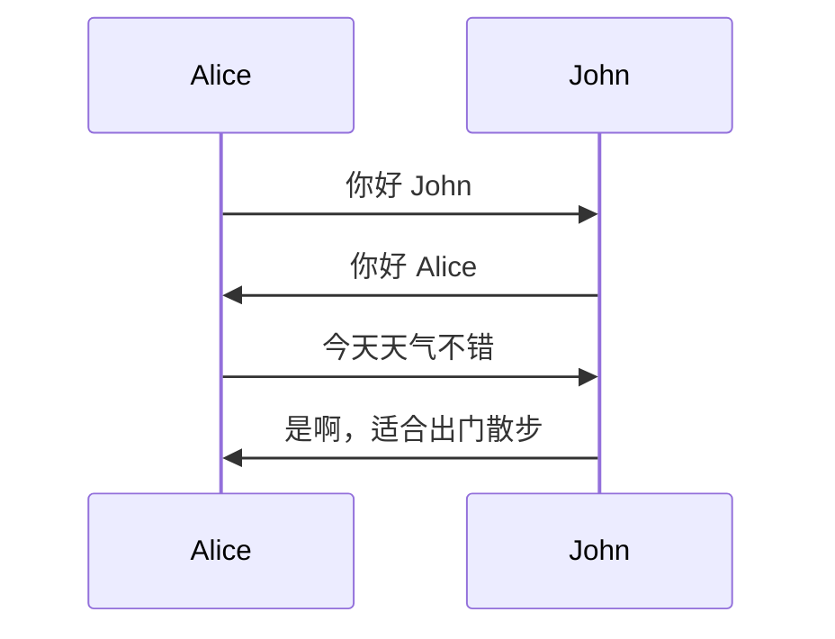
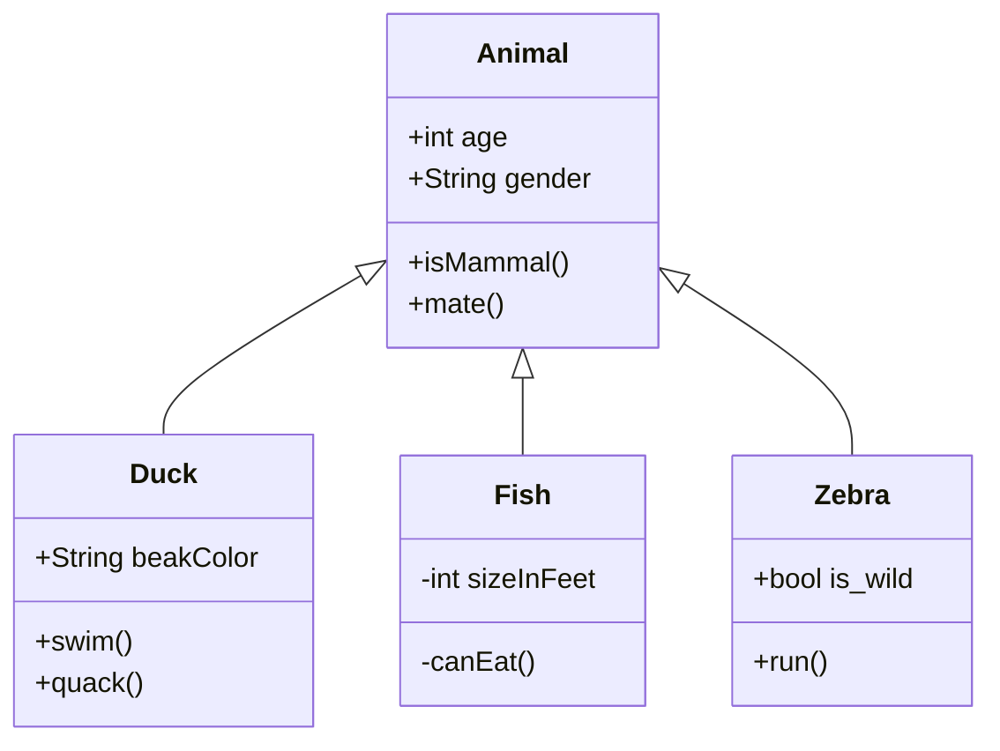

本文用于全面测试博客中已实现的 Obsidian 兼容特性。每个章节对应一项特性，请逐项确认渲染是否正确。

---

## 1. 高亮（==text==）

Obsidian 使用 `==text==` 语法来实现文本高亮。以下是一些测试用例：

- 这是普通文本，这是 ==高亮文本==，这是普通文本。
- 多个高亮：==第一个高亮== 和 ==第二个高亮== 相邻。
- 行内高亮混合：**粗体** 和 ==高亮== 和 *斜体* 同时使用。
- 长句中的高亮：这个句子中只有 ==这几个字== 被高亮标记出来。

---

## 2. Emoji

Obsidian 支持通过 `:emoji_name:` 语法插入 Emoji。以下是一些常用 Emoji：

- :smile: 微笑
- :heart: 爱心
- :rocket: 火箭
- :fire: 火焰
- :star: 星星
- :thumbsup: 点赞
- :clap: 鼓掌
- :wave: 挥手
- :bug: 虫子
- :computer: 电脑
- :book: 书籍
- :bulb: 灯泡（灵感）

组合使用：:rocket: :fire: :star: 这应该显示三个连续的 Emoji。

---

## 3. 数学公式

### 行内公式

行内公式使用 `$...$` 包裹：

- 爱因斯坦的质能方程：$E = mc^2$
- 勾股定理：$a^2 + b^2 = c^2$
- 欧拉公式：$e^{i\pi} + 1 = 0$
- 希腊字母：$\alpha, \beta, \gamma, \delta, \epsilon$
- 高斯积分：$\int_{-\infty}^{\infty} e^{-x^2} dx = \sqrt{\pi}$
- 导数：$\frac{d}{dx}e^x = e^x$

### 块级公式

块级公式使用 `$$...$$` 包裹：

$$
\sum_{i=1}^{n} x_i = \frac{n(n+1)}{2}
$$

$$
\lim_{n \to \infty} \left(1 + \frac{1}{n}\right)^n = e
$$

$$
\oint_C \mathbf{E} \cdot d\mathbf{l} = -\frac{d}{dt} \int_S \mathbf{B} \cdot d\mathbf{A}
$$

---

## 4. 脚注

Obsidian 支持使用 `[^n]` 语法添加脚注。

这是一个带有脚注的句子[^1]。这里还有一个脚注[^2]。

脚注也可以出现在句子中间[^3]，像这样。

[^1]: 这是第一条脚注的定义，包含详细的补充说明。
[^2]: 这是第二条脚注，用于解释某个术语的具体含义。
[^3]: 这是第三条脚注，位于句子中间的情况。

---

## 5. Wikilink 双向链接

Obsidian 的 Wikilink 语法使用 `[[双括号]]` 实现内部链接。

### 基础链接

- [[Hello World]] — 指向已存在的「Hello World」文章
- [[test]] — 指向已存在的「test」页面
- [[About]] — 指向已存在的「About」页面

### 带别名的链接

- [[Hello World|点我回首页]] — 显示别名「点我回首页」，实际指向 Hello World
- [[About|关于页面]] — 显示别名「关于页面」，实际指向 About

### 带标题锚点的链接

- [[Hello World#Welcome]] — 指向 Hello World 文章的 Welcome 标题
- [[test#Section]] — 指向 test 文章的 Section 标题

### 损坏的链接（断链）

- [[不存在的页面]] — 此页面不存在，应显示为红色虚线边框的断链样式
- [[这是一个不存在的页面|别名断链]] — 带别名的断链

---

## 6. Embed 嵌入

Obsidian 使用 `![[Page]]` 语法嵌入其他页面内容。

### 嵌入已有页面

![[About]]

上面是 About 页面的嵌入内容。

![[Hello World]]

上面是 Hello World 文章的嵌入内容。

### 嵌入不存在的页面（断链嵌入）

![[不存在的页面]]

上面应该显示为错误嵌入样式。

---

## 7. Callout 警告框（12 种类型全覆盖）

以下是全部 12 种 Callout 类型的完整测试：

### 7.1 Note

> [!note] 笔记提示
> 这是一条 note 类型的 callout。
> 它用于显示一般的笔记信息。
> 这里还有第三行内容以供测试。

### 7.2 Tip

> [!tip] 小贴士
> 这是一条 tip 类型的 callout。
> 它用于给用户提供实用的建议和小技巧。
> 记得在合适的时候使用这个类型。

### 7.3 Warning

> [!warning] 注意事项
> 这是一条 warning 类型的 callout。
> 用于提醒用户注意潜在的问题。
> 请仔细阅读这里的每一条内容。

### 7.4 Danger

> [!danger] 危险警告
> 这是一条 danger 类型的 callout。
> 用于显示高风险或不可逆操作的警告。
> 请务必在操作前确认所有条件。

### 7.5 Info

> [!info] 信息来源
> 这是一条 info 类型的 callout。
> 用于提供额外的背景信息或参考资料。
> 更多详情请查阅官方文档。

### 7.6 Question

> [!question] 思考问题
> 这是一条 question 类型的 callout。
> 用于提出值得思考的问题。
> 为什么 callout 的样式如此重要？

### 7.7 Example

> [!example] 代码示例
> 这是一条 example 类型的 callout。
> 用于展示实际的代码或操作示例。
> ```javascript
> console.log("Hello from callout!");
> ```

### 7.8 Quote

> [!quote] 名人名言
> 这是一条 quote 类型的 callout。
> 用于引用名人名言或重要文献。
> 「学而不思则罔，思而不学则殆。」—— 孔子

### 7.9 Todo

> [!todo] 待办事项
> 这是一条 todo 类型的 callout。
> - [x] 实现高亮语法
> - [x] 实现 Emoji
> - [ ] 完善测试文章
> - [ ] 部署到生产环境

### 7.10 Important

> [!important] 重要提示
> 这是一条 important 类型的 callout。
> 用于标记最关键、最需要关注的信息。
> 请优先阅读此处的全部内容。

### 7.11 Summary

> [!summary] 内容摘要
> 这是一条 summary 类型的 callout。
> 用于对前文内容进行概括性总结。
> 本文全面测试了博客的 Obsidian 特性兼容性。

### 7.12 Abstract

> [!abstract] 文章摘要
> 这是一条 abstract 类型的 callout。
> 类似于 summary，用于展示文章的概要信息。
> 本文涵盖了高亮、Emoji、数学公式、脚注、Wikilink、嵌入、Callout、Mermaid 图表等多种特性。

---

## 8. Mermaid 图表

### 8.1 流程图 (Flowchart)



### 8.2 时序图 (Sequence Diagram)



### 8.3 甘特图 (Gantt Chart)


### 8.4 类图 (Class Diagram)



---

## 9. 普通引用

以下是一条普通的引用，它**不应该**被渲染为 callout 样式：

> 这是一条普通的引用，不是 callout。
> 它应该显示为普通的引用样式，带有左侧的引用竖线。
> 这里的文本没有任何特殊的图标或背景颜色。

---

## 10. 代码块语法高亮

### JavaScript

```javascript
function greet(name) {
  console.log(`Hello, ${name}!`);
}

// 斐波那契数列
function fibonacci(n) {
  if (n <= 1) return n;
  return fibonacci(n - 1) + fibonacci(n - 2);
}

console.log(fibonacci(10)); // 输出: 55
```

### Python

```python
def fibonacci(n):
    if n <= 1:
        return n
    return fibonacci(n-1) + fibonacci(n-2)

# 列表推导式示例
squares = [x**2 for x in range(10)]
print(squares)  # 输出: [0, 1, 4, 9, 16, 25, 36, 49, 64, 81]

# 装饰器示例
def decorator(func):
    def wrapper(*args, **kwargs):
        print("调用前")
        result = func(*args, **kwargs)
        print("调用后")
        return result
    return wrapper

@decorator
def say_hello():
    print("你好！")
```

### CSS

```css
.container {
  display: flex;
  justify-content: center;
  align-items: center;
  min-height: 100vh;
  background: linear-gradient(135deg, #667eea 0%, #764ba2 100%);
}

.card {
  padding: 2rem;
  border-radius: 8px;
  box-shadow: 0 10px 30px rgba(0, 0, 0, 0.1);
}
```

### 没有指定语言的代码块

```
这是一段没有指定语言的纯文本代码块。
它应该使用默认的代码块样式进行渲染。
前后应该有代码块的背景色和边框。
```

---

## 11. 列表和表格

### 无序列表

- 第一项
- 第二项
- 第三项
  - 嵌套项 A
  - 嵌套项 B
    - 更深嵌套 i
    - 更深嵌套 ii
- 第四项

### 有序列表

1. 第一步：准备工作
2. 第二步：执行任务
3. 第三步：检查结果
   1. 子步骤 A
   2. 子步骤 B
4. 第四步：收尾工作

### Markdown 表格

| 特性 | 状态 | 优先级 | 备注 |
|------|------|--------|------|
| 高亮 (==) | ✅ 已实现 | 高 | markdown-it-mark |
| Emoji | ✅ 已实现 | 中 | markdown-it-emoji |
| 数学公式 | ✅ 已实现 | 高 | MathJax |
| 脚注 | ✅ 已实现 | 中 | markdown-it-footnote |
| Wikilink | ✅ 已实现 | 高 | 自定义脚本 |
| Embed | ✅ 已实现 | 高 | 自定义脚本 |
| Callout | ✅ 已实现 | 高 | markdown-it-container |
| Mermaid | ✅ 已实现 | 中 | CDN + 初始化脚本 |
| 普通引用 | ✅ 原生支持 | — | 标准 Markdown |
| 代码高亮 | ✅ 原生支持 | — | Hexo 内置 |

---

## 12. 综合混合测试

以下是一个混合多种语法的复杂段落：

> [!info] 混合语法示例
> 这个 callout 内部包含了多种语法：
>
> - 这是 ==高亮文字== 和 :star: Emoji 的组合
> - 数学公式：$x^2 + y^2 = z^2$
> - 内部链接：[[Hello World]]
> - 嵌入页面：![[About]]
>
> 这是一个完整的 **多功能混合段落**，用于测试复杂场景下的渲染兼容性。

以及一个带 Mermaid 和代码块的 callout：

> [!example] 综合示例
> 下方是一个 Mermaid 流程图：
>
> ```mermaid
> graph LR
>     A[输入] --> B[处理]
>     B --> C[输出]
> ```
>
> 以及一段代码：
>
> ```python
> print("Hello from hybrid test!")
> ```

---

*测试文章结束。请逐项检查以上所有特性的渲染效果，确保每个特性都按预期显示。*
